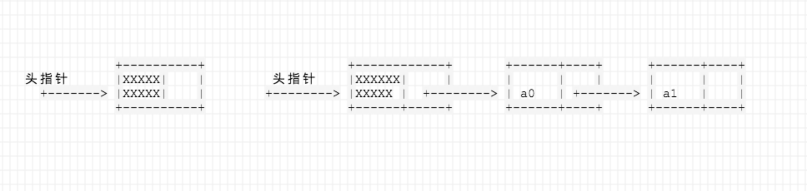

## 线性表

### 线性表的定义
    线性结构的特点是，除第一个和最后一个数据元素外，每个数据元素只有一个前驱数据元素和一个后继数据元素。

    线性表是一种可以在任意位置进行插入和删除数据元素操作的，
    由n（n>=0）个相同类型数据元素a0， a1，..., an-1组成的线性结构。

### 线性表的抽象数据类型
    
    数据集合
    线性表的数据集合可以表示为 a0， a1，... , an-1，每个数据元素的数据类型都是抽象数据元素的数据类型DataType
    
    操作集合
    初始化ListInitiate(L): 初始化线性表L 
    球当前数据元素个数ListLength(L):
    插入数据元素ListInsert(L, i, x)
    删除数据元素ListDelete(L, i, x)
    取数据元素ListGet(L, i, x)

### 线性表的顺序表示和实现

    线性表有两种存储结构：一种是顺序存储结构，另一种是链式存储结构。

    顺序存储结构的线性表称作顺序表

### 顺序表的存储结构

    当采用C语言描述数据结构问题时，实现顺序存储结构的方法是使用数组。
    数组有静态数组和动态数组。不论静态数组还是动态数组，只是申请空间的方法不同而已。

    顺序表采用从0开始编号，以便和C语言的数组下标0编号相吻合。
    对于不同的数据元素编号方法，数据元素ai 表示的是不同的数据元素值。


    顺序表的结构体
```c
typedef struct
{
    DataType list[MaxSize];
    int size;
} SeqList;
// 其中，DataType为数组元素的数据类型，MaxSize表示数组的最大个数，
// size表示当期存储的数据元素的个数，且size<= MaxSize
```

### 顺序表操作的实现


### 线性表的链式表示和实现
    单链表中，构成链表的结点只有一个指向直接后继结点的指针域。
    | 数据域 | 指针域 |

    单链表结点的结构体可以定义为：
```c
typedef struct Node
{
    DataType data;
    struct Node *next;
} SLNode;
```




    
    单链表有带头结点结构和不带头结点结构两种。
    把指向单链表的指针称作 头指针。
    头指针所指的不存放数据元素的第一个结点称作 头结点。

    在不带头结点的单链表中头指针直接指向链表第一个结点数据元素。

    带头结点和不带头结点的实现区别：
    若设计为带头结点，则无论是在第一个数据元素前插入还是在其他数据元素
    结点前插入，都不会改变头指针的值。

    若设计为不带头结点，则在第一个数据元素结点前插入和在其他数据元素前
    插入算法的处理方法不同。


### 单链表的实现
    
    单链表的结点定义
```c
typedef struct Node
{
    DataType data;
    struct Node *next;
} SLNode;
```

    单链表的操作
    初始化 ListInitiate(SLNode **head)
```c
void ListInitiate(SLNode **head)
{
    *head = (SLNode *)malloc( sizeof(SLNode) );
    (*head)->next = null;
}
```

    求当前数据元素个数ListLength(SLNode *head)
```c
int ListLength(SLNode *head)
{
    SLNode *p;
    int len = 0;
    
    while( p->next !=NULL )
    {
        p = p->next;
        len += 1;
    }
    return len;
}


```


    
    


